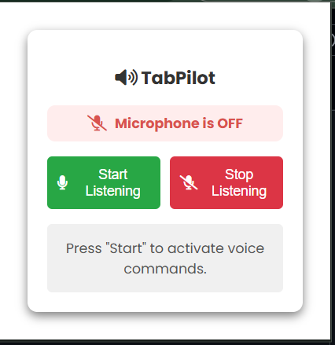

# voice-tab-controller
# 🎤 Speech-Controlled Chrome Extension  
🚀 A **Chrome Extension** that enables users to **control browser actions using voice commands**.  
With this, you can **open new tabs, navigate pages, scroll, bookmark sites, and more—hands-free!** 🎤  

  
*(Replace with actual screenshot)*  

---

## 📜 Table of Contents  
- [✨ Features](#-features)  
- [🛠 Installation](#-installation)  
- [📌 How to Use](#-how-to-use)  
- [🎤 Available Voice Commands](#-available-voice-commands)  
- [⚙️ Project Structure](#-project-structure)  
- [💡 How It Works](#-how-it-works)  
- [🚀 Hosting on GitHub](#-hosting-on-github)  
- [🤝 Contribution](#-contribution)  
- [📜 License](#-license)  

---

## ✨ Features  
✅ **Voice Recognition**: Use voice commands to control Chrome actions.  
✅ **Open Websites**: Say `"open google"` to launch Google in a new tab.  
✅ **Navigate**: Go **back/forward** using voice.  
✅ **Scroll**: `"scroll up"` or `"scroll down"` to navigate pages.  
✅ **Bookmark Pages**: Save your favorite pages hands-free.  
✅ **Real-Time Status**: UI updates to show microphone status.  
✅ **Works Continuously**: Keeps listening until you
